# Máquina: Poster

**Tryhackme: Poster**

# NMAP

Lo primero que haremos, será lanzar un NMAP para ver qué puertos tiene abiertos la máquina:

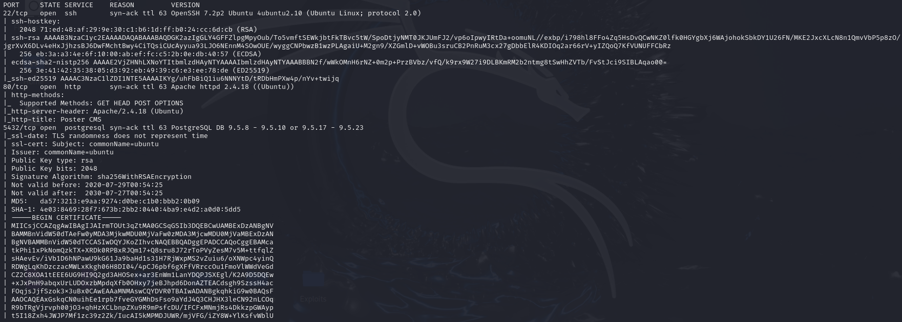

Como se observa en la imagen anterior, existen varios servicios que nos pueden interesar:

- Puerto 22: SSH
- Puerto 80: HTTP
- Puerto 5432: Postgresql

# Enumeración: Puerto 5432

Para obtener información sobre este puerto, vamos a utilizar un módulo auxiliar de Metasploit (auxiliary/scanner/postgres/postgres_login) que, si todo sale bien, nos mostrará las credenciales de inicio de sesión.

Las opciones que configuraremos en este caso, serán:

- RHOSTS
- USER_FILE (Podemos dejar el fichero que viene por defecto)
- PASS_FILE  (Podemos dejar el fichero que viene por defecto)

Después de configurar todo, escribiremos "run" y ejecutaremos el módulo.

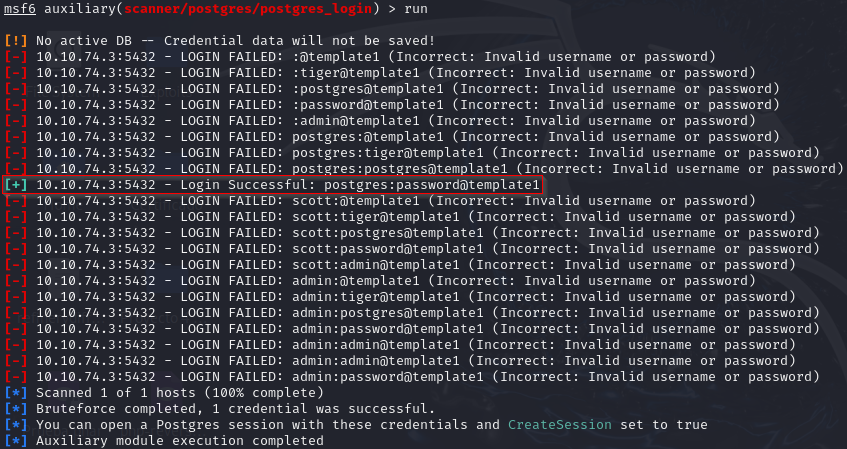

Como se observa en la imagen anterior, hemos conseguido unas credenciales de acceso: postgres:password

A continuación, utilizaremos otro módulo de Metasploit (auxiliary/admin/postgres/postgres_sql) que nos ayudará a conseguir más información sobre la BDD que estamos auditando. 

Nota: Para que el servidor de BDD nos proporcione más información, debemos de autenticarnos de manera legítima, por eso obtuvimos primero las credenciales para poder hacerlo.

Las opciones que configuraremos en este caso, serán:

- Password: La contraseña que encontramos anteriormente.
- Nombre de usuario: El usuario que encontramos anteriormente.
- RHOSTS

Después de configurar todo, escribiremos "run" y ejecutaremos el módulo.

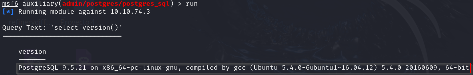

Como vemos en la imagen anterior, el servidor nos ha devuelto la versión de PostgreSQL que está utilizando.

Ahora vamos a intentar volcar los hashes de los usuarios de PostgreSQL utilizando otro módulo de Metasploit (scanner/postgres/postgres_hashdump).

Las opciones que configuraremos en este caso, serán:

- Password: La contraseña que encontramos anteriormente.
- Nombre de usuario: El usuario que encontramos anteriormente.
- RHOSTS

Después de configurar todo, escribiremos "run" y ejecutaremos el módulo.

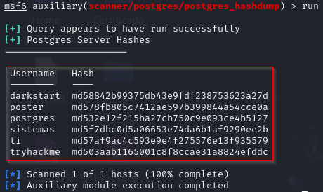

El módulo ha encontrado 6 usuarios con sus respectivos hashes.

También podemos leer archivos específicos del servidor de destino con el módulo (auxiliary/admin/postgres/postgres_readfile) o tal vez ejecutar comandos arbitrarios con "exploit/multi/postgres/postgres_copy_from_program_cmd_exec".

# Explotación: Puerto 5432

Ahora, como tenemos lo que necesitamos (credenciales), vamos a intentar obtener una reverse shell en el host de destino.

Para ello, usaremos uno de los módulos mencionados anteriormente, concretamente el "exploit/multi/postgres/postgres_copy_from_program_cmd_exec".

Las opciones que configuraremos en este caso, serán:

- Password: La contraseña que encontramos anteriormente.
- Nombre de usuario: El usuario que encontramos anteriormente.
- LHOST
- RHOSTS

Después de configurar todo, escribiremos "run" y ejecutaremos el módulo.

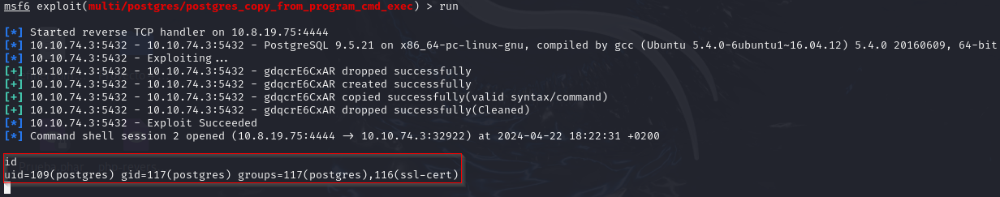

# Post explotación: Puerto 5432

A continuación, vamos a upgradear la shell que hemos recibido utilizando un módulo de post explotación de Metasploit llamado: post/multi/manage/shell_to_meterpreter.

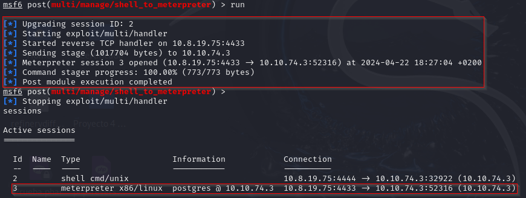

Bien, ahora que tenemos una Meterpreter creada, vamos a utilizar "linpeas.sh" para sacar más información sobre la máquina objetivo.

Primeramente, buscaremos el archivo "linpeas.sh" en Github. Una vez hayamos localizado el repositorio, lo descargaremos con "wget" en nuestra máquina.

Ahora lo que haremos será crear un "Simple Web Server" con Python3 y nos iremos a la sesión de Meterpreter que ya teníamos abierta y colocaremos el comando "shell", esto nos abrirá una shell interactiva.

A continuación, haremos un "wget" para traernos el fichero desde nuestra máquina a la máquina comprometida. Una vez tengamos el fichero, le daremos todos los permisos posibles. Por último, ejecutaremos el fichero utilizando el siguiente comando "./linpeas.sh".

Indagando en la salida obtenida por "linpeas.sh", nos encontraremos con dos ficheros que nos llamarán bastante la atención:

/home/dark/credentials.txt:

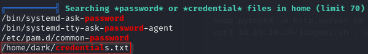

Si le hacemos un "cat" al fichero mencionado anteriormente, encontraremos unas credenciales en claro:

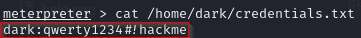

config.php:

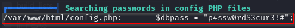

Si le hacemos un "cat" al fichero mencionado anteriormente, encontraremos unas credenciales en claro:

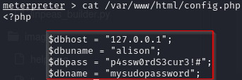

# Post explotación: Puerto 22

Ahora vamos a intentar acceder por SSH utilizando las credenciales de los dos usuarios que encontramos en los distintos ficheros vistos anteriormente.

## Usuario: Dark

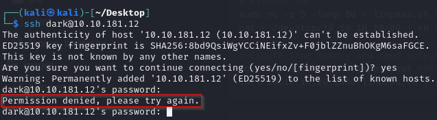

Como observamos en la imagen anterior, no podemos acceder como el usuario "dark" utilizando las credenciales que nos encontramos, por lo tanto, es un "Rabbit Hole".

## Usuaria: Alison

Sin embargo, introduciendo las credenciales de esta usuaria en el SSH, conseguimos acceder al sistema.

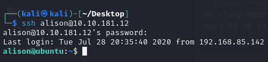

# Flag user.txt

Para encontrar la bandera, bastará con hacer un "ls" en el directorio "/home" de alison y con un "cat", lograremos verla.

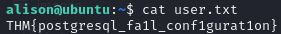

# Flag root.txt

Para encontrar, la bandera primero intentaremos escalar privilegios. Para ello, usaremos el comando "sudo -l" para ver qué comandos puede ejecutar alison como administradora.

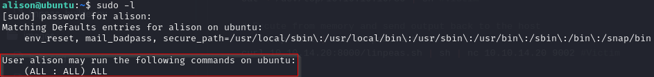

Como se observa en la imagen anterior, alison puede ejecutar todos los comandos del sistema como usuaria administradora.

Por lo tanto, vamos a hacer un "sudo su" y vamos a acceder al sistema como "root".

Una vez dentro, accedemos al directorio "/root", listamos el contenido del directorio y veremos la flag dentro.

Hacemos un "cat" y ya tendremos la flag de root.

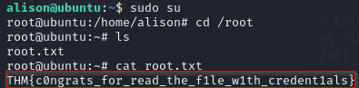

